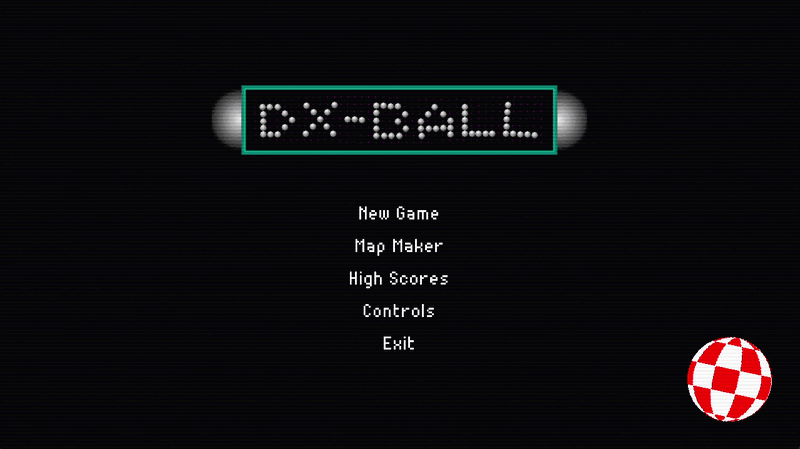
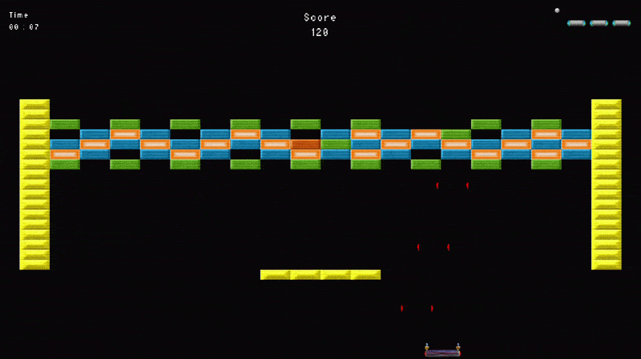
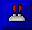
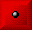
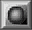
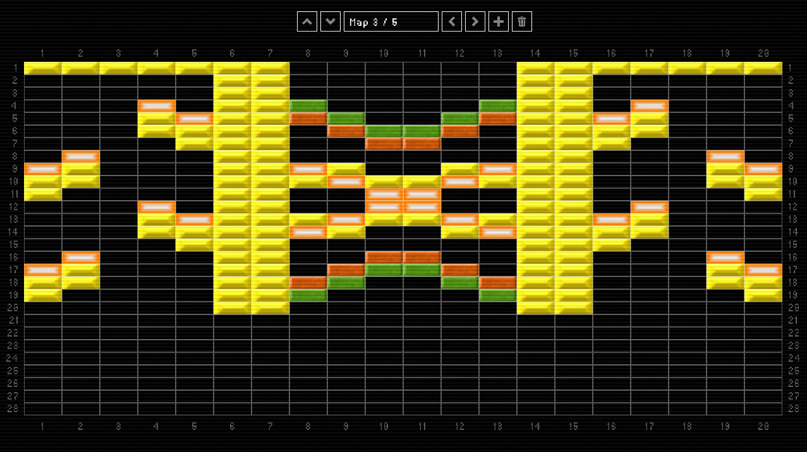

# DX-BALL

This project is a recreation of the iconic **DX-BALL** game, originally released in 1996. It was made using [raylib](https://www.raylib.com/) library in C.

## Table of Contents
- [Features](#features)
- [Installation and Usage](#installation-and-usage)
- [Credits and Acknowledgement](#credits-and-acknowledgement)
- [License](#license)

## Features
### Basic Gameplay

In DX-BALL, you control the paddle at the bottom of the screen and use it to keep the moving ball from falling off the bottom, while trying to get as much score as possible by breaking the bricks. There are several [perks](#perks) that make the game easier or harder, depending on their effects. Your goal is to get as much points as possible while completing as many levels as you can. There are **5** basic levels in the game as a start, but it is possible to add upto a total of 1000 maps in the game, using the [map maker](#map-maker).

The ball angle is controlled by where it bounces off of the paddle, depending on the distance of the ball from the center of the paddle. The scoring depends largely on the speed of the ball when it hits a brick.

 The top 10 players with the highest scores can be found in the highscores screen.

### Bricks
There are 5 types of bricks in the game: 3 standard bricks (, , ), indestructive bricks () and explosive bricks ().

### Perks
<!-- NOTE: edit number of perks when new ones added -->

At present, there are 10 different perks in the game with varying effects, listed below in no particular order:
-  Kill Paddle
-  Extra Life
-  Double Points
-  Expand Paddle
-  Shrink Paddle
-  Slow Ball
-  Fast Ball
-  Laser Paddle
-  Shrink Ball
-  Mega Ball

Perks like ,  and  which increase difficulty, also increase the score modifier in the game making riskier gameplay more rewarding.

### Map Maker

There is an inbuilt map maker/editor in the game where the player can edit any map in the game and create upto 1000 maps, which will load in order when playing the game.

## Controls

#### Paddle Controls
Use arrow keys or mouse to move the paddle.

#### Map Maker Controls
Use the ,  buttons at the top of the grid to switch maps. Use ,  to reorder maps. Use  to create a new map and  to delete a map.

For changing single bricks, use **LMB** and **RMB** to cycle through the brick types and **MMB** to reset a single brick.

For selecting multiple bricks, hold **CTRL** and drag mouse cursor while holding **LMB** to select a region or press **LMB** while holding **CTRL** to select bricks one by one. Selected bricks can be modified by **scrolling up/down** or alternatively, using the **up/down arrow keys**.

## Installation and Usage

The project contains all library files required to run the game. Simply clone this repository onto your system and then use the build task in [tasks.json](./.vscode/tasks.json) to compile the game.

You can find a compiled executable for Windows in the [releases](https://github.com/sh4dman23/dx-ball/releases/latest). Download **dx-ball-release.zip**, then unzip and run the game.

## Credits and Acknowledgement

This project was made by a team of two:

- Shadman Shahab ([Github](https://github.com/sh4dman23/) | [LinkedIn](https://www.linkedin.com/in/shadman-shahab/))
- Jawad Bin Mobin Akib ([Github](https://github.com/jbmakib) | [LinkedIn](https://www.linkedin.com/in/jbmakib/))

The following were used as reference for the game:
- [dx-ball.ru](https://dx-ball.ru/)
- [DX-Ball 2: A Complete Guide to Mechanics, Power-Ups and More](https://steamcommunity.com/sharedfiles/filedetails/?id=1573212121)

The art assets used in this game are credited to the following sources:
- [The Spriters Resource](https://www.spriters-resource.com/pc_computer/dxball)
- [thoth-tech/DXBallGame](https://github.com/thoth-tech/DXBallGame/tree/main/images)

The sound effects used in this game were obtained from [downloads.khinsider.com](https://downloads.khinsider.com/game-soundtracks/album/dxball-windows-gamerip-1996).

The music is part of the sound track of DX-BALL, obtained from [vgmpf.com](https://www.vgmpf.com/Wiki/index.php/DX-Ball_(W32)) and are credited to:

1. Ethno Papa (composed by Roland Corporation)
2. Ackerlight (composed by Frédéric Hahn)
3. Karn Evil 9: 1st Impression (composed by Keith Emerson, Greg Lake)
4. Freebee (composed by Jeff R. Bosset)
5. Overture from The Marriage of Figaro	(composed by Wolfgang Amadeus Mozart)

## License
This project is licensed under the MIT License. See [LICENSE](LICENSE) for more information.
